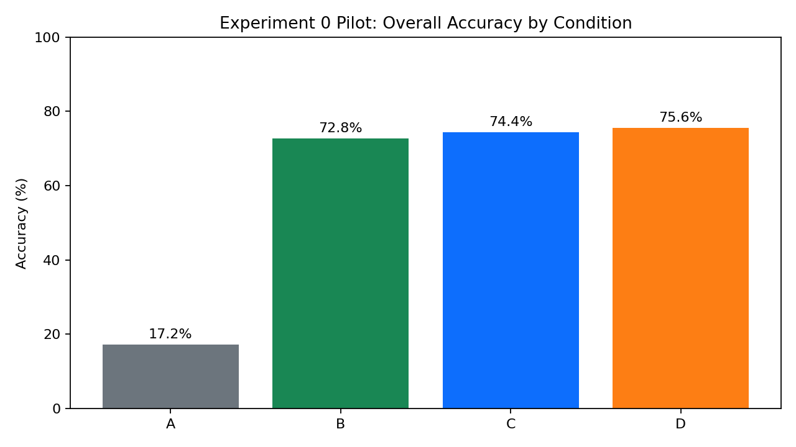
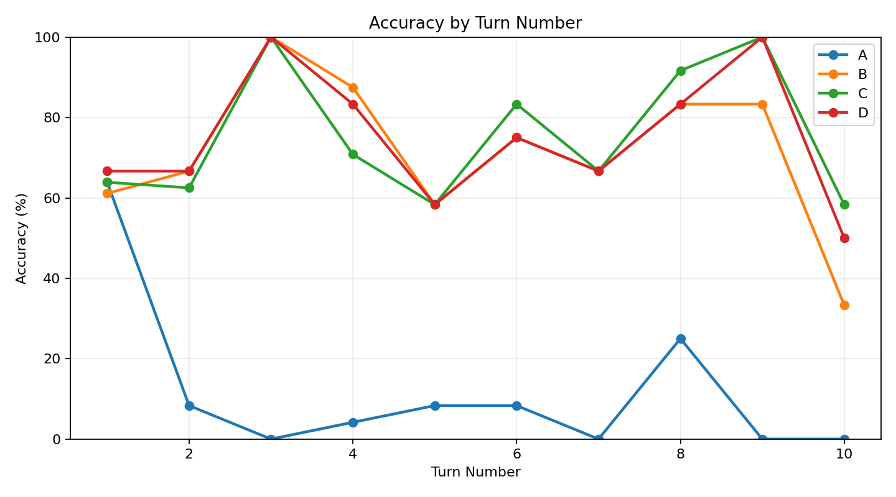
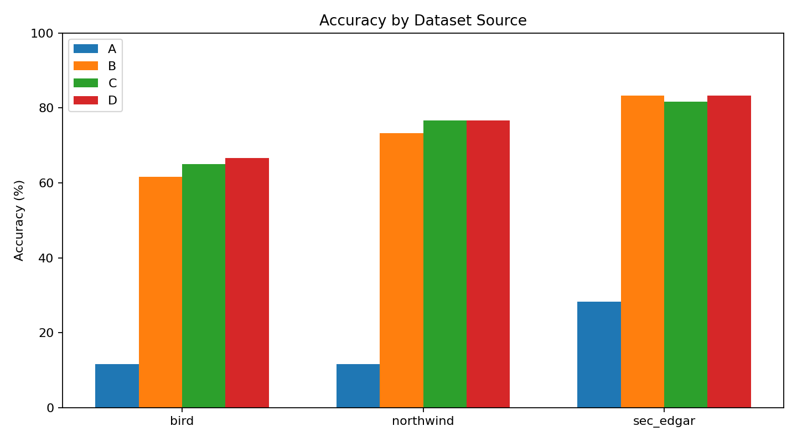
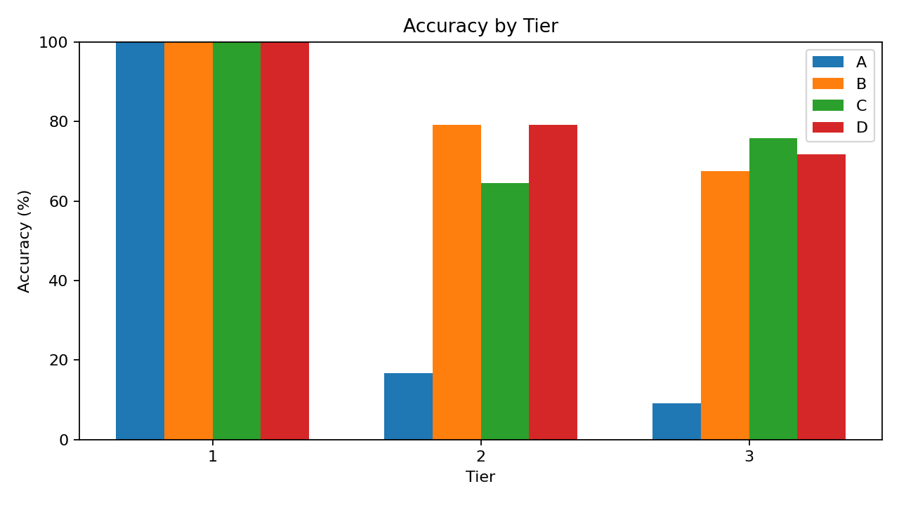

# Experiment 0 Small Run Report

- Results file: `results_20260316T004222Z_conds-A-B-C-D_tiers-1-2-3_sessions-36_model-gpt-5-mini_wm-5_epk-3_semk-2_e0_small_t123_s36.json`
- Summary file: `summary_20260316T004222Z_conds-A-B-C-D_tiers-1-2-3_sessions-36_model-gpt-5-mini_wm-5_epk-3_semk-2_e0_small_t123_s36.json`

## Framing

This is Experiment 0 in the enterprise AI memory program: a foundation study asking whether memory infrastructure materially improves multi-turn enterprise SQL tasks before moving on to backend comparisons or systems optimization. The practical industry framing matches the broader Forbes Technology Council angle in this repo: memory should be treated as infrastructure, not as an optional prompt add-on.

## Executive Summary

- Stateless performance remained low overall at `17.2%` (`31/180`).
- All memory-enabled conditions were far stronger overall: `B=72.8%`, `C=74.4%`, `D=75.6%`.
- The best overall condition in this pilot was `D`.
- Best condition by dataset varied: `northwind=C`, `sec_edgar=B`, `bird=D`.
- This means the pilot already supports the main E0 claim that memory matters, but it does not yet support a universal claim that one memory stack dominates all enterprise data settings.

## Overall Results

| Condition | Correct | Total | Accuracy | Gain vs A | MBS |
| --- | ---: | ---: | ---: | ---: | ---: |
| A | 31 | 180 | 17.2% | — | — |
| B | 131 | 180 | 72.8% | +55.6 pts | 322.6% |
| C | 134 | 180 | 74.4% | +57.2 pts | 332.3% |
| D | 136 | 180 | 75.6% | +58.3 pts | 338.7% |

## Key Findings

- Tier 2 favored `D` (`79.2%`), while Tier 3 slightly favored `C` (`75.8%`).
- `B` vs `C`: `B` won on `15` turns while `C` won on `18` turns.
- `B` vs `D`: `B` won on `15` turns while `D` won on `20` turns.
- `C` vs `D`: `C` won on `10` turns while `D` won on `12` turns.
- The overall pattern is that working memory already provides most of the benefit; episodic and semantic memory add value, but that value is domain-dependent rather than uniform.

## Dataset View

| Source | A | B | C | D | Best |
| --- | ---: | ---: | ---: | ---: | --- |
| bird | 11.7% | 61.7% | 65.0% | 66.7% | D |
| northwind | 11.7% | 73.3% | 76.7% | 76.7% | C |
| sec_edgar | 28.3% | 83.3% | 81.7% | 83.3% | B |

## Failure Pattern Snapshot

- `A` top failure labels: other_semantic_mismatch=109, sql_error=22, returns_extra_columns=21, wrong_granularity=15
- `B` top failure labels: other_semantic_mismatch=36, returns_extra_columns=12, wrong_granularity=11, company_name_vs_id=6
- `C` top failure labels: other_semantic_mismatch=35, wrong_granularity=11, returns_extra_columns=10, company_name_vs_id=5
- `D` top failure labels: other_semantic_mismatch=33, returns_extra_columns=10, wrong_granularity=8, company_name_vs_id=4

## Figures

## Forbes / Enterprise Hook

For enterprise AI leaders, the message from this pilot is not simply that memory helps. The more important conclusion is that memory helps exactly where enterprise workflows become conversational and stateful: follow-up questions, narrowed comparisons, and context-carrying analytical threads. Stateless agents are acceptable on first-turn questions, but they fail sharply once the user expects the system to remember prior analytical context. That is the infrastructure argument for enterprise memory systems.

## What Completes Experiment 0

- Expand beyond this 30-session pilot to a larger stratified slice or full corpus.
- Keep `A` as the baseline; do not remove it, because it quantifies both where memory helps and where memory adds no value.
- Report absolute accuracy and absolute gain vs `A` as the primary metrics; use MBS as a secondary interpretive metric.
- Follow with pairwise ablation analysis (`B` vs `C`, `C` vs `D`) by dataset to explain which memory layer is contributing in each domain.
